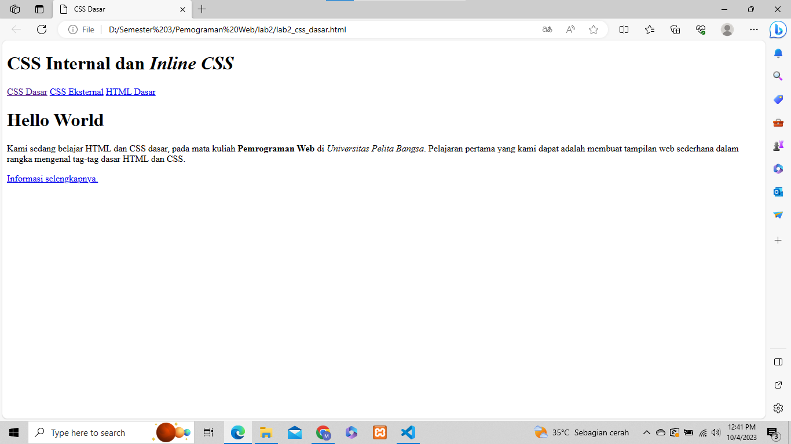
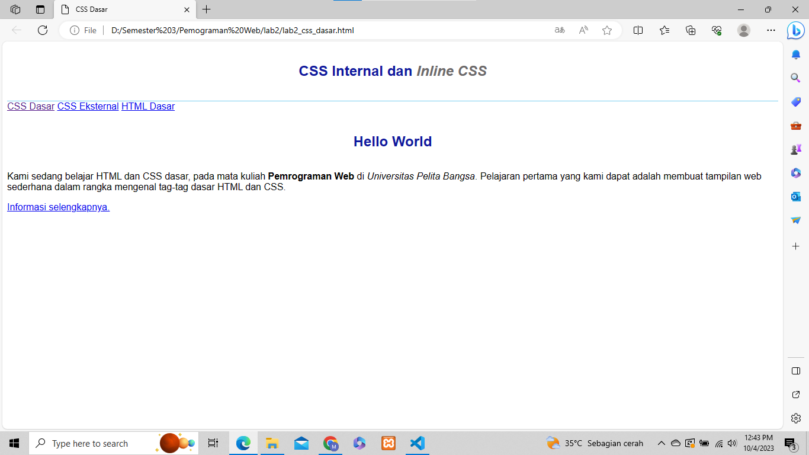
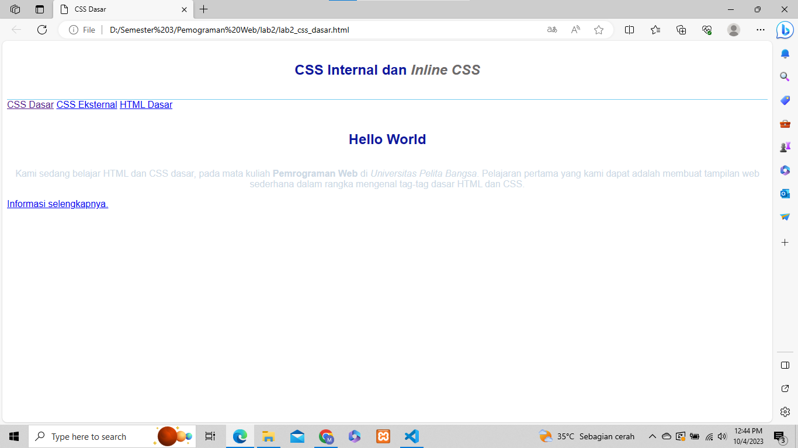
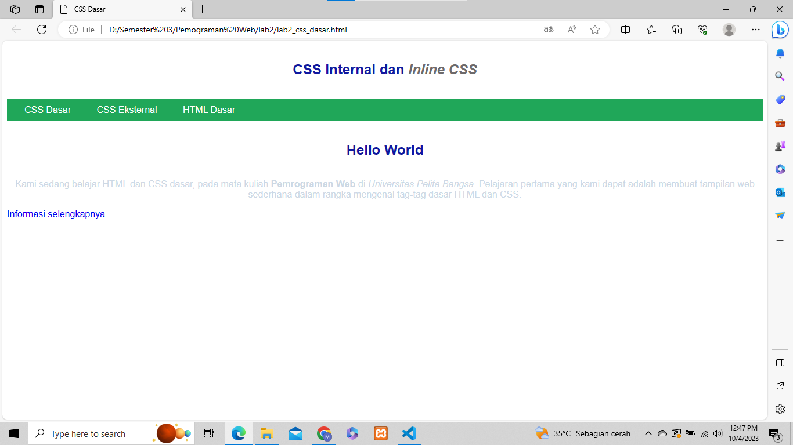
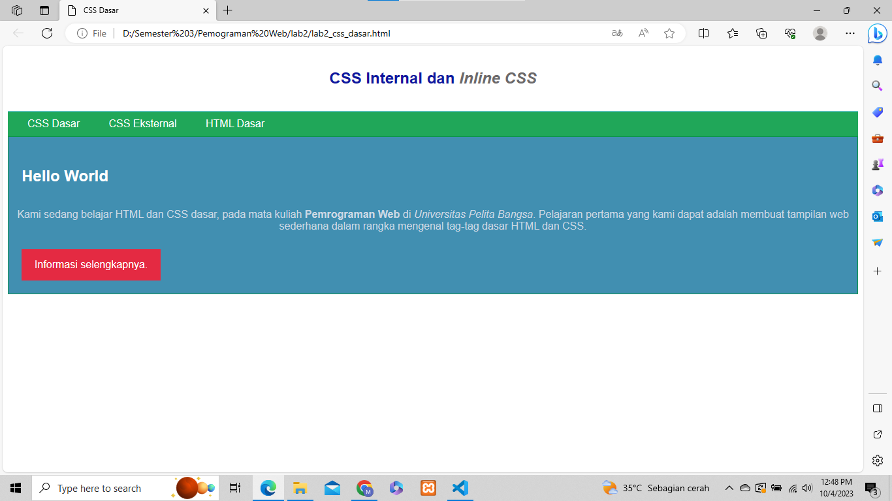
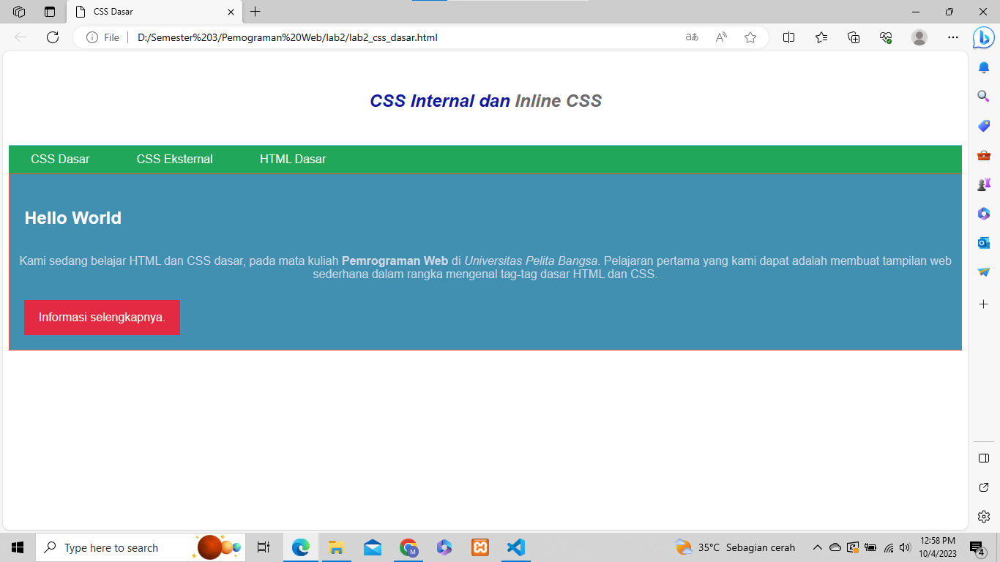

# Lab2Web

## PENGANTAR CSS 
- Cascading Style Sheet (CSS) merupakan aturan untuk mengatur beberapa komponen dalam sebuah web sehingga akan lebih terstruktur dan seragam. CSS bukan merupakan bahasa pemograman. CSS memudahkan dalam mengubah tampilan di berbagai halaman. Hanya dengan mengubah fungsi style di file CSS maka seluruh tampilan yang menggunakan fungsi tersebut akan berubah secara otomatis. CSS mempunyai atribut lebih beragam dibandingkan dengan HTML CSS memungkinkan konten dapat dioptimasi di lebih dari satu perangkat. Hampir seluruh website yang ada di internet menggunakan CSS di dalamnya. Selain tampilannya yang lebih menarik, kebanyakan browser populer saat ini juga mendukung CSS.

## Aturan Penulisan CSS
- Penulisan CSS dapat dilakukan dengan tiga cara, yaitu penulisan secara internal, external dan inline.
Internal adalah kode CSS ditulis pada dokumen HTML pada bagian head dokumen. External CSS adalah kode CSS ditulis terpisah dengan dokumen HTML berupa file Style Sheet (.css). Sedangkan Inline CSS adalah kode CSS ditulis sebagai artribut pada tag HTML.<br>
Penulisan Internal CSS menggunakan tag **style** yang diletakkan pada **head** dokumen.

## LANGKAH-LANGKAH PRAKTIKUM 
1. Buatlah dokumen HTML seperti berikut 

```html
<!DOCTYPE html>
<html lang="en">
<head>
 <meta charset="UTF-8">
 <meta name="viewport" content="width=device-width, initial-scale=1.0">
 <title>CSS Dasar</title>
</head>
<body>
 <header>
 <h1>CSS Internal dan <i>Inline CSS</i></h1>
 </header>
 <nav>
 <a href="lab2_css_dasar.html">CSS Dasar</a>
 <a href="lab2_css_eksternal.html">CSS Eksternal</a>
 <a href="lab1_tag_dasar.html">HTML Dasar</a>
 </nav>
 <!-- CSS ID Selector -->
 <div id="intro">
 <h1>Hello World</h1>
 <p>Kami sedang belajar HTML dan CSS dasar, pada mata kuliah <b>Pemrograman
Web</b> di <i>Universitas Pelita Bangsa</i>. Pelajaran pertama yang kami dapat
adalah membuat tampilan web sederhana dalam rangka mengenal tag-tag dasar HTML
dan CSS.</p>
 <!-- CSS Class Selector -->
 <a class="button btn-primary" href="#intro">Informasi selengkapnya.</a>
 </div>
</body>
</html>
```



2. Kemudian tambahkan deklarasi CSS internal seperti berikut pada bagian head dokumen.
```html
<head>
 <title>CSS Dasar</title>
 <style>
 body {
 font-family:'Open Sans', sans-serif;
 }
 header {
 min-height: 80px;
 border-bottom:1px solid #77CCEF;
 }
 h1 {
 font-size: 24px;
 color: #0F189F;
 text-align: center;
 padding: 20px 10px;
 }
 h1 i {
 color:#6d6a6b;
 }
 </style**>
</head>

```



3. Kemudian tambahkan deklarasi inline CSS pada tag **p** seperti berikut
```html
<p style="text-align: center; color: #ccd8e4;">

```



4. Membuat CSS Eksternal

```css
nav {
background: #20A759;
color:#fff;
padding: 10px;
}
nav a {
color: #fff;
text-decoration: none;
padding:10px 20px;
}
nav .active,
nav a:hover {
background: #0B6B3A;
}
```



5. Menambahkan CSS Selector
```css
/* ID Selector */
#intro {
background: #418fb1;
border: 1px solid #099249;
min-height: 100px;
padding: 10px;
}
#intro h1 {
text-align: left;
border: 0;
color: #fff;
}
/* Class Selector */
.button {
 padding: 15px 20px;
background: #bebcbd;
color: #fff;
display: inline-block;
margin: 10px;
text-decoration: none;
}
.btn-primary {
background: #E42A42;
}

```

<br>

### Pertanyaan & Tugas

1. Lakukan eksperimen dengan mengubah dan menambah properti dan nilai pada kode CSS
dengan mengacu pada CSS Cheat Sheet yang diberikan pada file terpisah dari modul ini.

```css
body {
    font-family: 'Arial', sans-serif;
}
body {
    color: #333;
}
header {
    padding: 10px 0;
}
.button {
    background: #FFA500;
}
.button:hover {
    background: #FFD700;
}
nav a {
    margin-right: 20px;
}
header {
    font-size: 18px;
}
#intro {
    border-color: #FF5733;
}
nav a:hover {
    color: #FF5733;
}
<h1 style="font-style: italic;">CSS Internal dan <i>Inline CSS</i></h1>

```

<br>

2. Apa perbedaan pendeklarasian CSS elemen h1 {...} dengan #intro h1 {...}? berikan
penjelasannya!

- h1 {...}: Ini adalah pendeklarasian CSS untuk elemen **h1** secara umum. Ini akan mempengaruhi semua elemen **h1** di halaman web, tidak peduli di mana mereka berada.

- #intro h1 {...}: Ini adalah pendeklarasian CSS untuk elemen **h1** yang berada di dalam elemen dengan id "intro". Hal ini akan mempengaruhi elemen **h1** yang terdapat dalam elemen dengan id "intro" saja.

3. Apabila ada deklarasi CSS secara internal, lalu ditambahkan CSS eksternal dan inline CSS pada elemen yang sama. Deklarasi berikut yang akan ditampilkan pada browser? Berikan penjelasan dan contohnya!

- Inline CSS (Highest Priority) : Deklarasi CSS yang ada dalam atribut stylepada elemen HTML akan memiliki prioritas tertinggi dan akan ditampilkan.

- CSS Internal : Deklarasi CSS yang ada di dalam tag **style** secara internal akan memiliki prioritas di bawah inline CSS dan di atas CSS eksternal.

- CSS Eksternal (Prioritas Terendah) : Deklarasi CSS yang terdapat dalam file eksternal yang dihubungkan melalui tag **link** akan memiliki prioritas paling rendah.

4. Pada sebuah elemen HTML terdapat ID dan Class, apabila masing-masing selector tersebut
terdapat deklarasi CSS, maka deklarasi manakah yang akan ditampilkan pada browser?
Berikan penjelasan dan contohnya!

```html
<p id="paragraf-1" class="text-paragraf"> 
```

- Inline style : Ini adalah deklarasi CSS yang ditempatkan langsung dalam atribut styleelemen HTML. Mereka memiliki prioritas tertinggi.

- ID selector : Deklarasi yang menggunakan ID selector (ditandai dengan #) memiliki prioritas lebih tinggi daripada class selector.

- Pemilih kelas : Deklarasi yang menggunakan pemilih kelas (ditandai dengan .) memiliki prioritas lebih rendah daripada penyeleksi ID.

- Pemilih elemen : Jika tidak ada gaya inline, penyeleksi ID, atau penyeleksi kelas yang cocok, maka deklarasi dengan menggunakan elemen pemilih (misalnya p) akan digunakan.